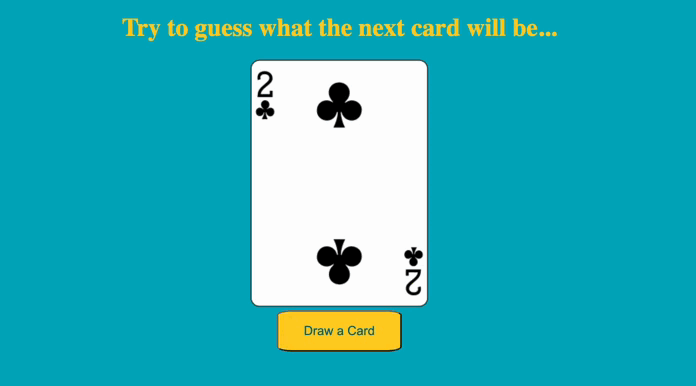

### Small project using the Deck of Cards API.     

Upon requesting a shuffled deck, a random card is generated and displayed.

When the user clicks on the button a new random card will be display.

♠︎ ♣︎ ♥︎ ♦︎

